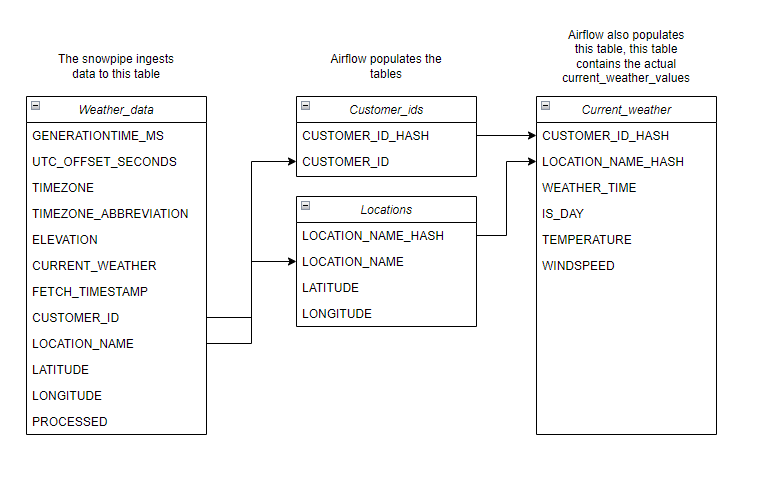

# Snowflake-Datapipe

The goal was to build an example of what a simple data collection pipeline which collects data from multiple customers and uploads them to Snowflake. The OpenMeteo Api acts as the "customer system" in this case.

# Project overview

Lets imagine a case where a company for example sells various data analysis services, this could include a set of softwares that allows the customer to analyze their own data and/or services where the company gives recommendations to the customer based on data collected.

The company has multiple customers with on-premises servers which run other services provided by the company. One of these services is a tool that collects data from customer systems and stores them locally on the on-premises servers.

To enable the datadriven services the company wants to collect the data from multiple customers but at the same time keep the pipeline simple and easily maintainable. This project aims to explore a one possibility of creating a solution which runs on those on-premises servers and collects the data and uploads it to Snowflake.

The solution which ingests data from straight of the customer system should be easily maintainable and it should take into account that in the future there may rise a need to add other solution(s) that ingest data from other sources. For example the company could have a case where the customer wants to send data via email to be analyzed by the company.

To take into account the possibility of expansion of solutions I would like to set up a system where the needed transformations to the data are done before ingesting the data to Snowflake. In other words I would like for the data to arrive in the same format to Snowflake regardless of the used collection method. This makes the pipeline more manageable as we dont have to update the Snowflake logic everytime we add a new data source.

# The on-premises collection logic overview

## Requirements
The current version of the collecting logic requires a Python installation on the on-premises server.

## Installation 
To install the data collection tool on the customer on-premises server the company represantive either goes to on-site or establishes a remote connection to the server with for example RDP.

Then the person creates a new folder for the installation and pastes the following files to the folder: ```config.ini```, ```init_app.py```, ```get_data.py```, ```dump_files.py``` & the customer specific s3 bucket access keys. These files can be found from under the ```Scripts``` directory.

After the files have been uploaded then the ```config.ini``` is to be filled with the customer specific info. After the config has been filled the application can be initialized by running ```python init_app.py``` via CMD in the directory where the files are.

Schedule the following Python Scripts using Windows Task Scheduler: ```get_data.py``` & ```dump_files.py```. This article is a good example on how to do this https://www.jcchouinard.com/python-automation-using-task-scheduler/

### What do the files do?

```config.ini``` is the ini-file that is meant to be filled before initializing the "application". It contains the datapoints we want to collect from the customer and the customerid which will be used to identify which datapoints belong to which customer in Snowflake. 

```init_app.py``` script is ran after filling the ```config.ini```. The purpose of the script is to create the needed directories for the data, logs and customer specific config. The customer specific config contains the same data as the one filled by hand but also the filepaths which will be used by the ```get_data.py``` & ```dump_data.py```.

```get_data.py``` is the script responsible for collecting the data. In this demo case it collects data from OpenMeteo api. In short it does the following:

1. Requests data from the api.
2. Saves the data as json file to the temp directory.
3. Tries to upload the file to s3, if the upload is successfull the file is deleted from temp. If not the file is moved to the dump directory.

```dump_files.py``` this script is responsible for trying to dump the files from the dump directory to s3. The script tries to upload to s3 from the dump folder, if the file upload succeeds the file is deleted, if not the file is kept for a later try.

NOTE: S3 accesskeys not in the repo.

# Pipeline description

## Overall architecture 


The pipeline works by collecting JSONs sent by the get_data.py and dump_data.py scripts operating in the customer systems in the source s3 bucket. From there a Lambda function parses the data and uploads it to another s3 bucket. After the file lands in the target s3 bucket, SQS sends a message to the snowpipe which then copies the data to a table in Snowflake.

Airflow DAG is scheduled to run every 10 minutes and it spreads the raw ingested data to other tables:
1. If customerId is not on the customers table it will insert it there.
2. Same for location.
3. It also parses the VAR column containing the actual values from the customer and uploads them to current_weather table.
4. Finally the DAG marks the row from weather_table to processed to avoid inserting duplicate rows to current_weather table.

DAG tasks:


# Database design



* Weather_data is the table where the raw data is ingested by the snowpipe.
* Customer_ids & Locations tables keep track of the customers and locations in the database. These tables are populated by an Airflow job that inserts data to them from the Weather_data table. No duplicate values will be inserted.
* The Current_weather table has the actual data from weather_data current_weather var column. This data is parsed and inserted by Airflow.


# Downsides and improvement ideas for the system.

## Data ingestion
First and foremost, at the moment the customer specific AWS keys are stored in raw CSV files. This means if this approach would be used in customer systems the raw CSV files would need to placed in their system. The customer or a another party with the access to system could take the keys and use them to flood the s3 bucket if they so wished. In short this approach is not viable for anything else than personal projects, for production use maybe the approach could be modified to use winSCP and authenticate with SSH.

## Data from staging to fact tables
Airflow works pretty well in this case where the dataflow is pretty small. But lets say the the dataflow increased to 10000 times to the current one. Airflow might still be able to handle adding the data to the fact tables but it would also generate extra costs since the logic is that it checks if new values are added by querying the database. 

A better approach would be using somekind of change data capture (CDC) to capture the changes in the staging table and act upon those changes. Maybe Snowflake streams could be used for this purpose?
